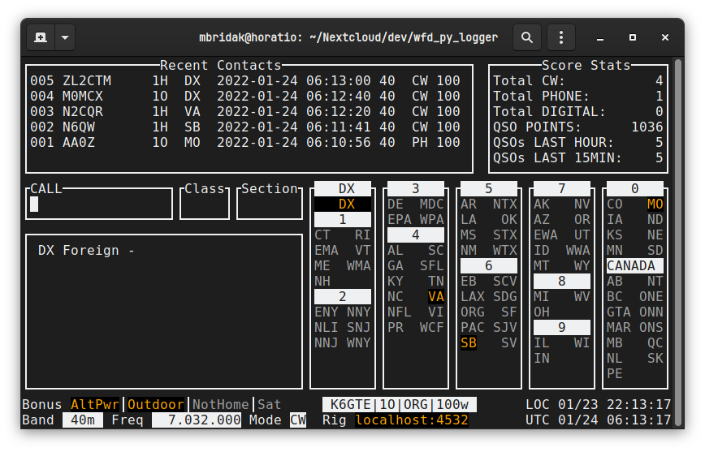
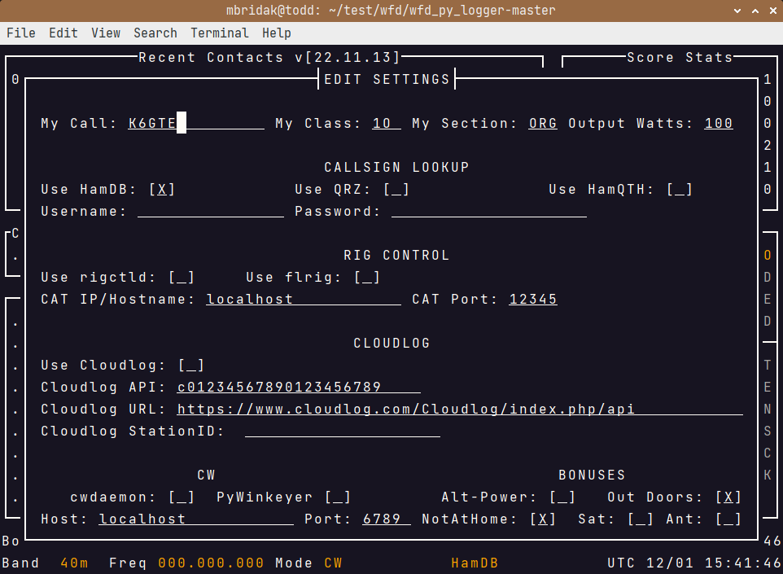
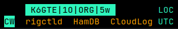
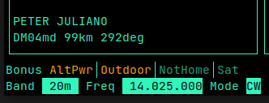
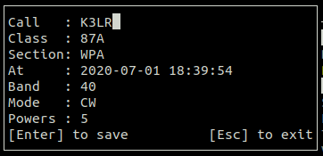
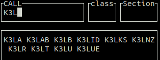
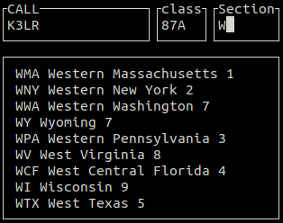
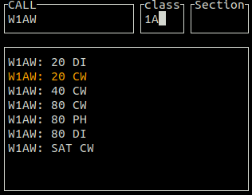

## K6GTE Winter Field Day logger (Curses)

The logger is written in Python 3, and uses the curses lib. It will work with Linux and Mac, but since the Windows curses lib is lacking it will not work properly in Windows. 

**A newer version based on PyQt5 can be found [here](https://github.com/mbridak/WinterFieldDayLogger)**.

The log is stored in an sqlite3 database file 'WFD_Curses.db'. If you need to wipe everything and start clean, just delete this file. The screen size expected by the program is an 80 x 24 character terminal. Nothing needs to be installed, compiled etc... Just make WFD_Curses.py executable and run it within the same folder.

I decided to write this after the 2018 Winter Field Day when I couldn't find a simple Linux logger for the event. I didn't need multiuser logging or GPS disciplined time servers. Just a simple logger with dup checking that could generate a cabrillo log for submission.



## Requirements

It requires Python3, BeautifulSoup (bs4), lxml and requests.

`sudo apt install python3-requests python3-bs4 python3-lxml`


## Recent Changes

After 3+ years of neglect for the curses version, it was in need of some TLC. It's been one large monolithic chunk of code from the start. I've decided to break it into manageable chunks (classes). 

So far we have:

* cat_interface.py Abstraction class "CAT" for both rigctld and flrig.
* database.py well... does database stuff.
* lookup.py Abstraction class for QRZ, HamQTH and HamDB
* preferences.py Decided to move all the preferences from the sqlite table and into a json file. This makes it easier to edit for the user and straight forward  to load and save.
* edittextfield.py A slightly better than nothing at all Class to handle entering text... You guessed it. In a field.
* Made an actual Edit Settings screen leveraging the previous mentioned EditTextField class. The SettingsScreen class lives in settings.py .

[Russ K5TUX](https://lhspodcast.info/) has made several pull requests with new features. Which to be honest, shamed me into looking at the code again, and seeing the absolute horror show the layers of cruft and years of neglect has brought.

So many hours/days have been spent on making the code more PEP8 compliant.

## Caveats

This is a simple logger meant for a single op, it's not usable for clubs. There's no networking between logging machines etc.

## Initial Setup

After launching the program you may want to access the new Edit Settings screen by using the command listed in the next section. Here you can setup your call/class/section, CAT, callsign lookup, Cloudlog intigration.



Navigate the screen by pressing either `TAB` or `Shift-TAB`. Settings with brackets `[_]` are boolean. `[_]` means disabled and `[X]` is enabled. They can either be toggled with the `SPACE` key, or pressing either one of these `XxYy1` to enable, or one of these `Nn0` to disable it.

After you make your changes, either press the `Enter` key to save your changes, or the `Esc` key to abort any changes and exit the screen.

## Commands:

Commands start with a period character in the callsign field and are immediately followed by any information needed by the command.

```
.H displays a short list of commands.
.Q Quit the program.
.S Access the settings screen
.P# Sets the power level, .P5 will set the power to 5 watts.
.MCW .MPH .MDI Sets the mode. CW Morse, PH Phone, DI Digital.
.B# sets the band, .B40 for 40 meters.
.D# Deletes log entry. .D26 will delete the log line starting with 026.
.E# Edits log entry. .E26 will edit the log line starting with 026.
.L Generate Cabrillo log file for submission.

[esc] abort input, clear all fields.
```

After the command is entered press the ENTER key to execute it.

## Logging

Okay you've made a contact. Enter the call in the call field. As you type it in, it will do a super check partial (see below). Press TAB or SPACE to advance to the next field. Once the call is complete it will do a DUP check (see below). It will try and Autofill the next fields (see below). When entering the section, it will do a section partial check (see below). Press the ENTER key to submit the contact to the log. If it's a busted call or a dup, press the ESC key to clear all inputs and start again.

## Features

#### Radio Polling via rigctld or flrig

You can enable/disable the use of rigctld or flrig in the settings screen. The flrig default port is 12345, and the default rigctld port is 4532.

The radio will be polled for band/mode updates automatically. There is an indicator at the bottom of the logging window to indicate polling status. Dim if no connection or timeout, and highlighted if all okay.



#### QRZ, HamQTH, HamDB

You can enable callsign lookups by enabling them in the settings screen. If you choose either QRZ or HamQTH place you credentials for that service in the username and password fields provided.

#### Cloudlog

You can enable automatic logging to Cloudlog in the settings screen. Here you can enter your API key and URL to the service, along with a station ID if needed.

#### Bearing to contact

Once you put in your own call and choose a lookup provider, the program looks up your gridsquare. I did this because I didn't want to change the settings screen... I'm not kidding. After this, and after it looks up the grid for the other person, it'll show you the bearing and distance to the contact.  



#### Editing an existing contact

Use the Up/Down arrow keys or PageUp/PageDown to scroll the contact into view. Your mouse scroll wheel may work as well. Double left click on the contact to edit, or use the '.E' command. Use the TAB or Up/Down arrow keys to move between fields. Backspace to erase and retype what you need.
Once done press the Enter key to save, or the Escape key to exit.



#### Super Check Partial
If you type more than two characters in the callsign field the program will filter the input through a "Super Check Partial" routine and show you possible matches to known contesting call signs. Is this useful? Doubt it.



#### Section partial check
As you type the section abbreviation you are presented with a list of all possible sections that start with what you have typed.



#### DUP checking
Once you type a complete callsign and press TAB or SPACE to advance to the next field. The callsign is checked against previous callsigns in your log. It will list any prior contact made showing the band and mode of the contact. If the band and mode are the same as the one you are currently using, the listing will be highlighted, the screen will flash, a bell will sound to alert you that this is a DUP. At this point you and the other OP can argue back and forth about who's wrong. In the end you'll put your big boy pants on and make a decision if you'll enter the call or not.



#### Autofill
If you have worked this person before on another band/mode the program will load the class and section used previously for this call so you will not have to enter this info again.

## TODO
  * Enter a contact at a specific time.

Let me know if you think of something else.
